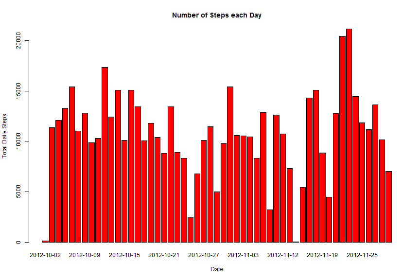
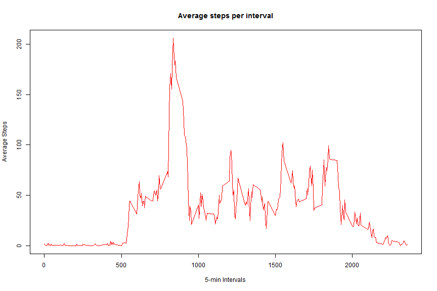
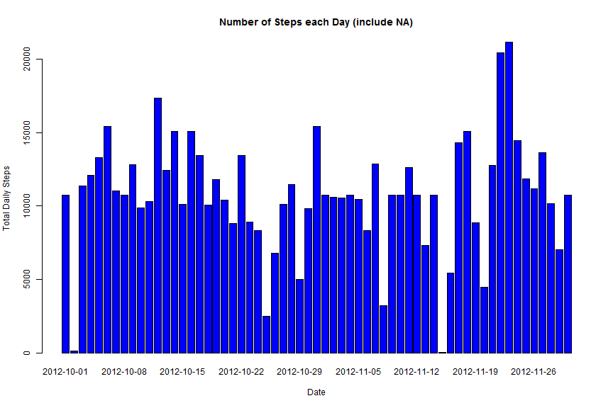
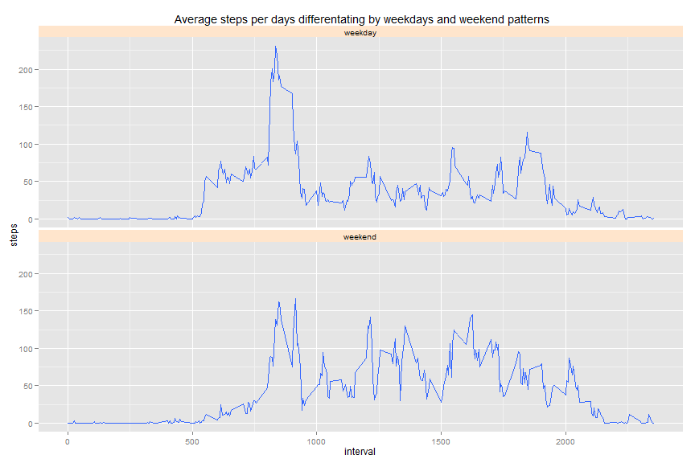

## Loading and preprocessing the data
``` 
activityData <- data.frame(read.csv("./activity.csv", header = TRUE, sep = ","))
activityData.sub <- subset(activityData, steps != "NA")
```

## What is mean total number of steps taken per day?

```r
totalSteps <- aggregate(activityData.sub$steps, by=list(day = activityData.sub$date), FUN = "sum")
histogram<-barplot(totalSteps$x, names.arg =totalSteps$day, 
      xlab = "Date",ylab="Total Daily Steps", main="Number of Steps each Day", col="red")
```

 


```r
# Calculate and report the mean and median total number of steps taken per day
mean(totalSteps$x,na.rm=TRUE)
```

```
## [1] 10766.19
```

```r
median(totalSteps$x,na.rm=TRUE)
```

```
## [1] 10765
```

## What is the average daily activity pattern?

```r
# Make a time series plot (i.e. type = "l") of the 5-minute interval (x-axis) and 
# the average number of steps taken, averaged across all days (y-axis)
head(activityData.sub)
```

```
##     steps       date interval
## 289     0 2012-10-02        0
## 290     0 2012-10-02        5
## 291     0 2012-10-02       10
## 292     0 2012-10-02       15
## 293     0 2012-10-02       20
## 294     0 2012-10-02       25
```

```r
aveSteps <- aggregate(steps~interval, activityData.sub, FUN = "mean")
plot(aveSteps, type = "l", xlab="5-min Intervals", ylab="Average Steps", 
     main="Average steps per interval", col="red")
```

 

```r
# Which 5-minute interval, on average across all the days in the dataset, 
# contains the maximum number of steps?
aveSteps$interval[which.max(aveSteps$steps)]
```

```
## [1] 835
```

```r
# Calculate and report the total number of missing values in the dataset 
# (i.e. the total number of rows with NAs)
sum(!complete.cases(activityData))
```

```
## [1] 2304
```
## Inputing missing values

```r
# Devise a strategy for filling in all of the missing values in the dataset. 
# The strategy does not need to be sophisticated. 
# For example, you could use the mean/median for that day, or the mean for that 5-minute interval, etc.
# --> Use mean to replace NA value

activityNew <- merge(activityData,aveSteps, by = "interval", suffixes = c("","Mean"))
naData <- is.na(activityNew$steps)
activityNew$steps[naData] <- activityNew$stepsMean[naData]

head(activityNew)
```

```
##   interval    steps       date stepsMean
## 1        0 1.716981 2012-10-01  1.716981
## 2        0 0.000000 2012-11-23  1.716981
## 3        0 0.000000 2012-10-28  1.716981
## 4        0 0.000000 2012-11-06  1.716981
## 5        0 0.000000 2012-11-24  1.716981
## 6        0 0.000000 2012-11-15  1.716981
```

## Are there differences in activity patterns between weekdays and weekends?

```r
# Create a new dataset that is equal to the original dataset but with the missing data filled in.
activityNew <- activityNew[, c(1:3)]
head(activityNew)
```

```
##   interval    steps       date
## 1        0 1.716981 2012-10-01
## 2        0 0.000000 2012-11-23
## 3        0 0.000000 2012-10-28
## 4        0 0.000000 2012-11-06
## 5        0 0.000000 2012-11-24
## 6        0 0.000000 2012-11-15
```

```r
# Make a histogram of the total number of steps taken each day and 
# Calculate and report the mean and median total number of steps taken per day. 
# Do these values differ from the estimates from the first part of the assignment? 
# What is the impact of inputing missing data on the estimates of the total daily number of steps?

totalStepsNew <- aggregate(activityNew$steps, by=list(day = activityNew$date), FUN = "sum")

histogram<-barplot(totalSteps$x, names.arg =totalSteps$day, 
        xlab = "Date",ylab="Total Daily Steps", 
        main="Number of Steps each Day (exclude NA)", col="red")
```

 

```r
histogram<-barplot(totalStepsNew$x, names.arg =totalStepsNew$day, 
        xlab = "Date",ylab="Total Daily Steps", 
        main="Number of Steps each Day (include NA)", col="blue")
```

 

```r
mean(totalStepsNew$x,na.rm=TRUE) 
```

```
## [1] 10766.19
```

```r
median(totalStepsNew$x,na.rm=TRUE) 
```

```
## [1] 10766.19
```

```r
# --> mean is the same after filling in missing values but median is shifted slightly.
# --> The impact is minimal.

# Create a new factor variable in the dataset with two levels 
# - "weekday" and "weekend" indicating whether a given date is a weekday or weekend day.
activityNew$levels <- ifelse(weekdays(as.Date(activityNew$date)) 
                      %in%  c("Saturday", "Sunday"),'weekend','weekday') 
head(activityNew)
```

```
##   interval    steps       date  levels
## 1        0 1.716981 2012-10-01 weekday
## 2        0 0.000000 2012-11-23 weekday
## 3        0 0.000000 2012-10-28 weekend
## 4        0 0.000000 2012-11-06 weekday
## 5        0 0.000000 2012-11-24 weekend
## 6        0 0.000000 2012-11-15 weekday
```

```r
# Make a panel plot containing a time series plot (i.e. type = "l") of the 5-minute interval 
# (x-axis) and the average number of steps taken, averaged across 
# all weekday days or weekend days (y-axis). 

library(ggplot2)
qplot(x=interval, y=steps,data=subset(activityNew, complete.cases(activityNew)),
      geom='smooth', stat='summary', fun.y=mean) + facet_grid(levels~.) + facet_wrap(~levels,nrow=2) + theme(strip.background = element_rect(fill="#ffe5cc")) + labs(title=' Average steps per days differentating by weekdays and weekend patterns')
```

 
